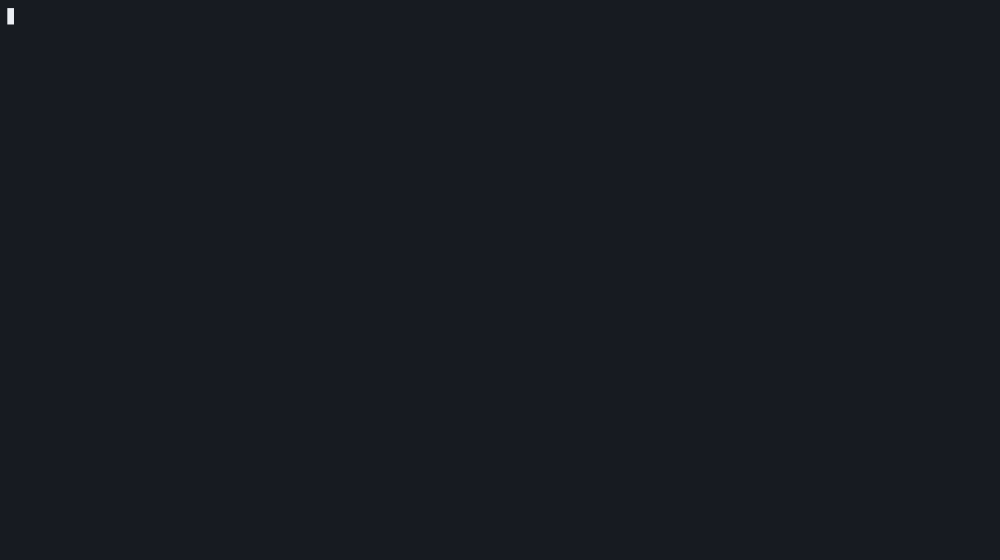

# TheKnight

Cloud misconfiguration scanner for AWS that doesn't just report — it opens
the pull request that fixes it.



The two IAM findings above are the *same* misconfiguration (`Action: "*"`)
on two different roles — one gets `critical`, the other `high`, because
only one of them can be assumed from outside the AWS account. That's the
exposure-based severity weighting, not a coincidence. (Recording is
against real LocalStack-provisioned resources through the actual compiled
binary — see [Testing](#testing) for how.)

## What it does

TheKnight scans an AWS account for the misconfigurations that cause most
breaches — public S3 buckets, over-permissioned IAM roles, security groups
open to the world — and ranks them so a small team can act on the ones that
matter instead of triaging a 400-line report.

The detection engine (this repo) is open source. The idea is that a fix
shouldn't require logging into another dashboard: point TheKnight at a
Terraform-managed AWS account and it proposes the patch as a PR against
the infra repo, reviewed and merged like any other change.

## Status

Both commands are real. `theknight scan` discovers S3 buckets, IAM roles,
and EC2 security groups against a live AWS account and evaluates five
rules (`s3-public-read`, `s3-public-write`, `iam-wildcard-action`,
`iam-wildcard-resource`, `sg-open-ingress`). `theknight remediate` runs the
same scan and renders the Terraform fix + explanation for each finding —
see `theknight remediate --help`. Discovery, rule evaluation, and
remediation templates are all unit tested against fakes; no AWS account is
needed to run `go test ./...`.

The two IAM templates are deliberately conservative: neither tries to
guess a minimal action or resource set to replace a wildcard, since
there's no static-analysis way to know what a role actually needs. Both
point at IAM Access Analyzer's CloudTrail-based policy generation instead
of rendering a fix that looks confident but might be wrong — the S3 and
security-group templates have a real safe default, these don't.

`s3-public-write` fires off both the bucket ACL and the bucket policy: once
`GetBucketPolicyStatus` confirms a bucket is public, the scanner parses the
policy document itself (mirroring what it already does for IAM) to tell
whether the public grant covers read, write, or both — a public
read-via-policy bucket no longer gets misclassified as also publicly
writable. The read/write split is only trusted when parsing succeeds;
if the policy document can't be read for some other reason, read falls
back to the generic "policy says public" signal (preserving prior
behavior) but write is never assumed without positive evidence —
overclaiming impact in a security report is worse than underclaiming it.

Severity is weighted by real exposure, not just rule identity:
`sg-open-ingress` is Critical for a protocol `-1` rule (every port
reachable) and High for a specific sensitive port; `iam-wildcard-action` /
`iam-wildcard-resource` are Critical when the role's trust policy allows
assumption by a wildcard or cross-account principal, High when it's
scoped to an AWS service or the same account. Two roles with an identical
wildcard permission aren't the same risk if only one of them can be
assumed from outside the account — the severity should say so.

Findings are always sorted most-severe-first (`scan` and `remediate`
alike), `--output json` uses proper camelCase field names instead of raw
Go struct names, and the table's SEVERITY column is colorized when
writing to a real terminal — auto-disabled for piped or redirected
output, and respects `NO_COLOR`.

**MVP is complete.** Not built yet: actual PR creation (remediate output
goes to stdout, not a GitHub PR — that's V1). See
[docs/roadmap.md](docs/roadmap.md) for the full
build sequence.

## Usage

```
go build -o theknight ./cmd/theknight
./theknight scan --profile <aws-profile> --region us-east-1
./theknight scan --profile <aws-profile> --severity critical    # only critical findings
./theknight remediate --profile <aws-profile> --severity high   # high + critical, with fixes
```

`--severity` is a threshold, not an exact match — `--severity high` shows
high and critical, not just high. Same flag, same semantics, on both
commands.

Auth follows the standard AWS SDK credential chain (env vars, shared config
profile via `--profile`, instance role, etc).

## Security

**TheKnight is structurally read-only.** The `s3API`/`iamAPI`/`ec2API`
interfaces in `internal/scanner` (the only place this codebase talks to
AWS) declare nothing but `Get*`/`List*`/`Describe*` methods — no
`Put`/`Delete`/`Create`/`Update`/`Authorize`/`Attach`. That's not a policy
statement, it's the Go type signature every AWS call in this repo is
forced through; a call to a mutating API wouldn't compile. The full list,
and the minimal IAM policy it maps to if you want to run TheKnight under
a scoped-down role instead of a broad read-only grant:

```json
{
  "Version": "2012-10-17",
  "Statement": [{
    "Effect": "Allow",
    "Action": [
      "s3:ListAllMyBuckets",
      "s3:GetBucketAcl",
      "s3:GetBucketPolicy",
      "s3:GetBucketPolicyStatus",
      "s3:GetBucketPublicAccessBlock",
      "iam:ListRoles",
      "iam:ListAttachedRolePolicies",
      "iam:ListRolePolicies",
      "iam:GetRolePolicy",
      "iam:GetPolicy",
      "iam:GetPolicyVersion",
      "ec2:DescribeSecurityGroups"
    ],
    "Resource": "*"
  }]
}
```

`theknight remediate` never runs `terraform apply` and never opens a PR
(that's V1) — it prints Terraform to stdout for a human to read and
apply. The remediation templates are deliberately conservative about
this (see the IAM templates above) for the same reason: a tool asking to
be trusted near production infrastructure shouldn't guess.

That trust boundary is only as real as the string handling behind it,
though — a resource name embedded unescaped into generated Terraform
would be a real HCL-injection path regardless of how conservative the
templates claim to be. Every AWS-returned name (bucket, role, policy,
security group) gets `%q`-escaped before landing in generated output, not
just interpolated with `%s`. This wasn't purely theoretical: EC2 security
group names accept a much looser character set than S3 bucket names or
IAM role/policy names — spaces and several punctuation characters AWS
enforces but that LocalStack (this repo's own integration-test target)
doesn't necessarily validate identically — and one `%s` slipped through
in `internal/remediate/ec2.go`'s comment-line generation. A crafted group
name containing an embedded quote and newline could break out of the `#`
comment and inject a live top-level Terraform resource block that a
reviewer skimming the diff might miss. Fixed, and
`TestSGRestrictIngressCIDR_GroupNameIsEscaped` /
`TestSGOpenIngressRule_GroupNameIsEscapedInDescription` assert against
that exact payload so it can't regress silently.

`govulncheck` runs clean — `go.mod` is pinned to a Go toolchain version
with no known stdlib CVEs reachable through this codebase's actual call
paths (Go's toolchain auto-management fetches it on `go build`/`go test`,
no separate install step needed).

## Testing

Two tiers, on purpose:

- `make test` — fast, no external dependencies. Discovery is tested
  against hand-rolled fakes of the AWS SDK client interfaces
  (`s3API`/`iamAPI`/`ec2API`); rule and remediation logic is tested
  directly against `scanner.Resource`/`rules.Finding` fixtures. This is
  what CI should run on every commit.
- `make integration-test` — starts LocalStack in Docker, provisions real
  S3/IAM/EC2 resources, and runs the actual `discoverS3`/`discoverIAM`/
  `discoverSecurityGroups` functions against it. The fakes prove the
  detection logic is correct; this proves the AWS SDK request/response
  wiring — field names, pagination, URL-decoding policy documents — is
  correct too. Neither tier is a substitute for the other: a fake can be
  wrong about what AWS actually returns without any test catching it,
  which is exactly the failure mode this tier exists to close.

This tier caught two real things the fakes couldn't:

1. **A production bug.** `discoverS3` used to abort a bucket's *entire*
   metadata collection if any one of its three API calls failed. Against
   real AWS that means a bucket where one IAM grant is narrower than the
   others (`s3:GetBucketAcl` allowed, `s3:GetBucketPolicyStatus` denied,
   say) would silently vanish from the scan instead of reporting what
   could still be determined. Fixed to collect each signal independently.
2. **A stale assumption in the test itself.** AWS has enabled S3 Block
   Public Access by default on every new bucket since April 2023 — a
   public ACL alone no longer makes a bucket reachable. The first version
   of the "public bucket" integration test didn't account for that and
   failed against LocalStack's (correct) emulation of it, which is exactly
   the kind of drift between assumption and reality this tier exists to
   surface before a customer's AWS account does.

Pinned to `localstack/localstack:3.8.1` in the Makefile — newer LocalStack
builds fail fast on startup with a license-activation error unless
`LOCALSTACK_AUTH_TOKEN` is set, even for the core services this suite
needs. 3.8.1 is confirmed to run with zero config.

LocalStack Community also doesn't implement `GetBucketPolicyStatus`
(`internal/scanner/s3.go`'s tests handle that explicitly rather than
silently passing around it — see `requireOnlyKnownLocalStackGap`). Since
`bucketPolicyPermissions` (the S3 policy read/write parsing) is only
reached once that call confirms a bucket is public, its integration
coverage calls the function directly against a real `PutBucketPolicy` /
`GetBucketPolicy` round trip instead of going through the full
`discoverS3` path — LocalStack's own gap shouldn't get to veto testing
code that doesn't depend on the gap.

## Architecture

```
cmd/theknight/        CLI entrypoint (cobra)
internal/awsclient/   AWS SDK config/session resolution
internal/scanner/     Resource discovery, normalized into scanner.Resource
internal/rules/       Rule interface + registry; Evaluate() runs rules over resources
internal/remediate/   Terraform fix template registry; Generate() renders a Fix per Finding
internal/report/      table/json output
```

Rules and remediation templates are Go code registered via `init()`, not
data-driven config files — a rule is a `rules.Rule` implementation, a
template is a function keyed by `RemediationID`. That trades "edit a YAML
file to add a check" for real test coverage per rule/template; given the
detection logic here is genuinely conditional (public access block state,
JSON policy statement shape, per-port CIDR matching), that trade favors
correctness over configurability at this stage.

`scanner.Resource` is a normalized, provider-agnostic type — rules operate
on it rather than raw AWS SDK structs, so a GCP or Azure scanner can plug
into the same rule engine later without rewriting detection logic.

---

## If this were a startup

### The problem

Cloud misconfigurations are consistently one of the top causes of breaches
(public S3 buckets, over-permissioned IAM roles, open security groups).
Existing tools either dump a wall of findings with no prioritization a
human can act on (AWS Config, Prowler, ScoutSuite), are expensive
enterprise platforms only large companies can justify ($50k+/yr — Wiz,
Orca), or detect but don't fix, handing remediation back to an
already-underwater platform team.

The gap: engineering teams of 10–200 with a real cloud footprint, no
dedicated security team, and no budget for Wiz/Orca. They know they're
exposed but don't have the headcount to triage 400 findings a week.

### The wedge

Don't compete with Wiz on "comprehensive cloud security platform" — that's
crowded and well-funded. Compete on one narrow, sharp promise: **we find
the misconfigurations that actually matter, and we send you a pull request
that fixes them.** Detection-to-remediation in one PR, not a dashboard you
have to log into. Most competitors sell visibility; this sells time saved
— an engineer merges a PR instead of spending an afternoon in a security
dashboard. Shipping the fix into the workflow the customer already lives
in (GitHub) rather than adding another tool to check is the differentiated
distribution mechanism.

### ICP

Series A–C startups, 10–200 engineers, primarily AWS, Terraform-managed
infra (this matters — it's what makes a remediation PR tractable to
generate), no dedicated security hire but a security-conscious eng lead or
CTO who knows they're exposed. Findable in bulk via Crunchbase + "uses
Terraform" job postings.

### Business model

- **Open-core**: CLI scanner + rule engine open source — drives adoption,
  credibility, and inbound.
- **Paid layer**: hosted scheduled scans, the remediation-PR bot, Slack
  alerts, historical trend reporting (the "are we more or less secure this
  month" report a CTO shows their board).
- **Pricing**: usage-based on monitored resource count, matching value
  delivered and avoiding the enterprise sales cycle that kills most
  security startups at seed.
- **Land-and-expand**: free scanner to paid once the PR bot merges its
  first fix — that's the product-qualified-lead signal.

### Moat

- **Remediation corpus** — accumulated "finding pattern → verified-safe
  Terraform fix" mappings across real customer infra, compounding over
  time.
- **Workflow lock-in via GitHub** — once CI is wired to the PR bot,
  switching cost is real, unlike churning off a dashboard.
- **Trust** — security tooling is a trust business. Open-source detection
  plus never auto-applying changes (always PR, human-reviewed) is both an
  ethical stance and the reason a wary CTO lets you near their AWS account.

### MVP → V1 → V2

- **MVP** (this repo, 4–6 weeks): AWS-only CLI scanner + risk engine +
  remediation PR generator.
- **V1**: hosted scheduled scanning, Slack/GitHub integration, pricing
  page — a 2–3 month build on top of the MVP.
- **V2**: multi-cloud (GCP next), compliance report exports for SOC 2
  auditors, policy-as-code layer for customer-authored rules.

See [docs/roadmap.md](docs/roadmap.md) for the detailed build sequence.
